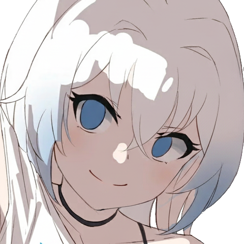

<p align="center">

    
</p>

<div align="center">
    

    <a href="https://discord.gg/DEkuZkmhpF">
        
    </a>

<\div>


# WaveAL
WaveAL is a pet project and mod that locally unlocks all downloaded skins, for Azur Lane.
Individual skin configurations are saved depending on region, account and server.

Haven't been banned in over a year of usage.

> [!IMPORTANT]
> The project currently only supports EN servers.

> [!IMPORTANT]  
> This project has only been tested on Windows 10/11.

Modifications are exclusively local, as we do not support harming other players' experiences.

Video demonstration:
<p align="center">
  <a href="https://www.youtube.com/watch?v=3l1suJZJ_hU">
    
  </a>
</p>


## 🥰 Future updates
- Do something about adb
- Add support for other server regions

## 😟 Debugging
- If you see strange output in the output window (console), it would be a good idea to report it immediately!
- ```PermissionError: [WinError 5] Access is denied.``` = Run the program with Administrator privileges.

## 🐛 Bug report
Encountered a bug? Ask for help in our Discord server before opening a ticket.
You can report crashes by copying and pasting the console's output.
Do not publicly share your logs .txt files, as there is a risk of losing your account.

I'd be very grateful for suggestions too!

[Join the Discord server](http://discord.gg/DEkuZkmhpF)
